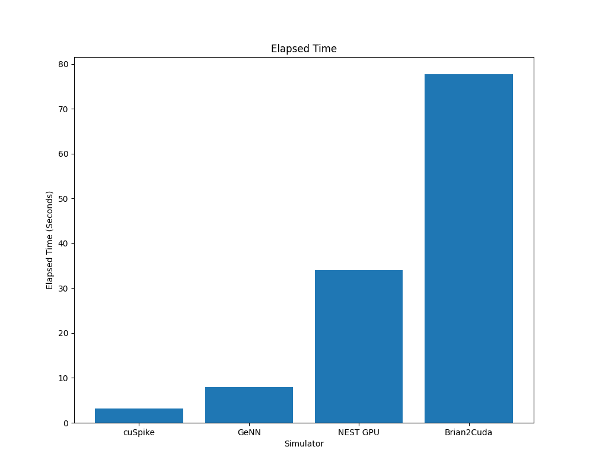

## cuSpike ##

cuSpike is a spiking neural network simulator targeting recent CUDA-capable GPUs. The simulator takes neuron models in its own domain specific language called CSM (**c**u**S**pike **M**odel), and produces CUDA code, which is then combined with the existing infrastructure code to produce a standalone simulator executable. Arbitrary ODE-based models (including but not limited to LIF and Hodgkin Huxley neurons) are supported, but there is currently no support for STDP or related learning mechanisms.

For small networks, the simulator utilizes cooperative groups and stores neuron state variables in registers to avoid kernel launch overhead and long memory access latency of the global memory. When the networks get large, in which case the neuron states cannot be fit into the registers, the simulator tries to exhaust shared memory entirely before starting to consume global memory for spike propagation.

## Installation

```
sudo dnf install flex bison
git clone https://github.com/kocatepedogu/cuspike.git
cd cuspike
```

## Usage ##

Place model definition under `models` directory. Execute the following under the root of the source directory.

```
./compile model-name.csm plot
```

The recorded spikes are written to `output/t_array.dat` and `output/s_array.dat` files. The first file stores the time of each spike whereas the second file stores the index of the neurons which produced those spikes. Both files are read by plot.py to produce the raster plot saved to `output/output.png`

## Examples ##

The CUBA benchmark model (for which the original reference implementation can be found in [Brian2 documentation](https://brian2.readthedocs.io/en/stable/examples/CUBA.html)) is provided as an example under `models` directory. The example has 20,000 neurons and simulates 100 seconds of biological time, which are higher than the original model (4000N/1s). To run the model:

```
./compile cuba.csm plot
```

## Benchmarks ##

The performance of cuSpike has been compared against three state-of-the-art simulators. To build a container in which all benchmarks can be performed, enter into the `docker` directory and run the `build` script. The script will create an AlmaLinux 9.4 container with Brian2Cuda (1.0a6), NEST GPU and GeNN (5.1.0) simulators, together with the CUDA Toolkit (12.6). Building the container may take up to an hour, mostly due to the long download time for the CUDA Toolkit. Both Podman and Docker should work properly independent of the host distribution. Please send a bug report if you encounter an error in this step. CUDA Container Toolkit is not required.

```
cd docker
./build
```

After the container image is built, enter into the benchmark directory and execute the benchmark script. The script runs cuSpike, GeNN, Brian2Cuda and NEST GPU with the CUBA model. 20,000 neurons are simulated for a biological time of 100 seconds. The figures below are generated at the end of benchmarks under `benchmark/cuba` directory.

```
cd ..
cd benchmark

./benchmark
```

The simulators are first executed without previously generated/cached files. This run provides the amount of time needed for both code generation/compilation and simulation. The results are presented below.


In the second benchmark, the simulators are run with existing files from the previous execution. Brian2Cuda and GeNN use a code generation approach and both are able to detect whether any changes has been made to the model. In case no changes are detected, both use the previously created binaries. cuSpike is also based on code generation, so the same effect is obtained by directly invoking the previously generated executable, although it is not able to do this automatically as of now.



NEST GPU does not use code generation, so the results do not differ significantly.

In addition to the CUBA model, the COBAHH (conductance based synapses, Hodgkin-Huxley neurons) model is also implemented and is part of the benchmark script. This model simulates 100,000 neurons for a biological time of 2 seconds. Its performance is currently compared only against Brian2Cuda. The results excluding the compilation time is given in the following plot.


## LICENSE

cuSpike is free software: you can redistribute it and/or modify
it under the terms of the GNU General Public License as published by
the Free Software Foundation, either version 3 of the License, or
(at your option) any later version.

cuSpike is distributed in the hope that it will be useful, but WITHOUT
ANY WARRANTY; without even the implied warranty of MERCHANTABILITY or
FITNESS FOR A PARTICULAR PURPOSE. See the GNU General Public License
for more details.

You should have received a copy of the GNU General Public License along
with cuSpike. If not, see <https://www.gnu.org/licenses/>.
